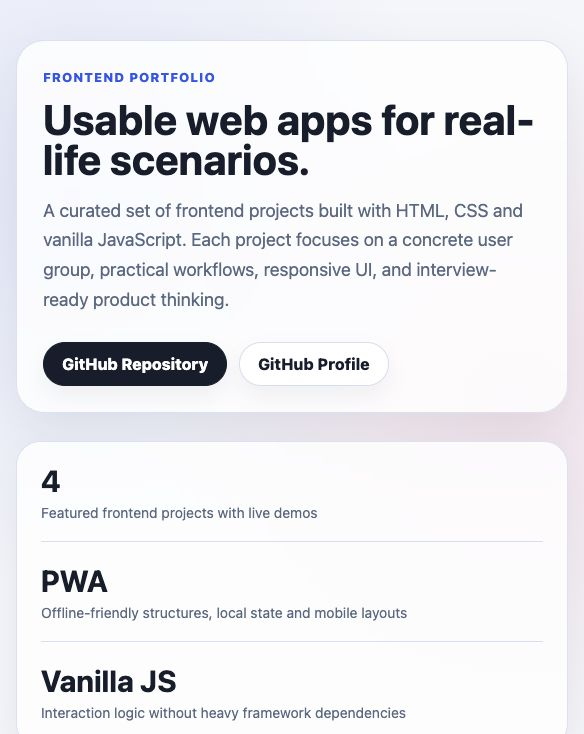
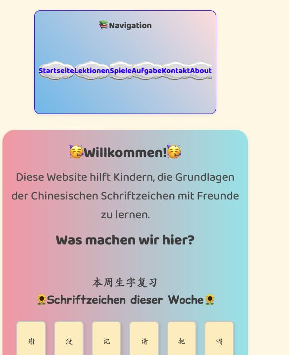
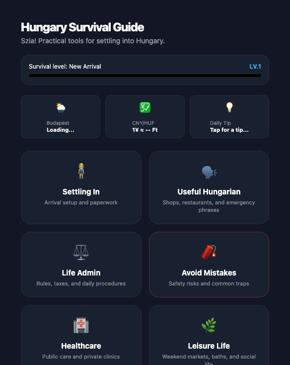
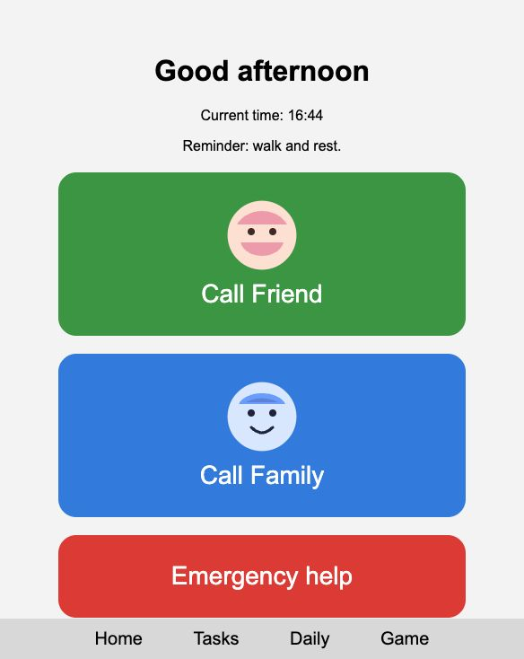
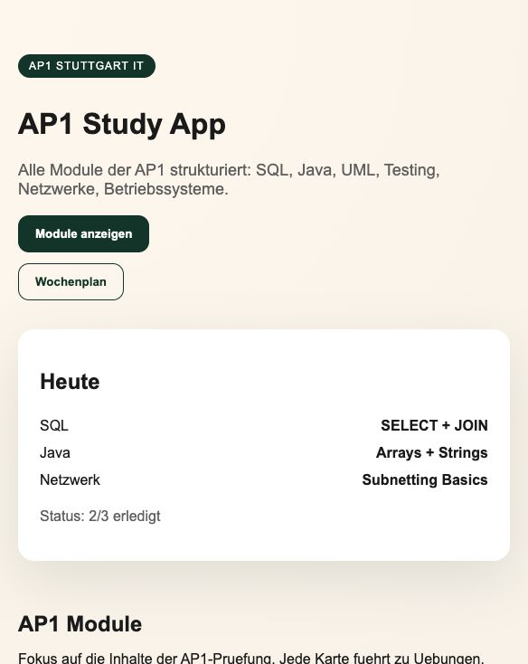

# Frontend Project Portfolio

This repository contains a curated set of frontend projects built for practical user scenarios.
The goal is not only to practice HTML/CSS/JavaScript, but to build small interview-ready products with target users, workflows, responsive layouts and clear documentation.

## Live Portfolio

- Portfolio landing page: https://lilarosa.github.io/frontend-projects/



## Featured Projects

| Project | Product Focus | Tech Stack | Live Demo |
|---|---|---|---|
| Chinese Learning Website | Child-friendly Chinese learning portal with characters, pinyin, poem practice, games and check-in support | HTML, CSS, JavaScript | https://lilarosa.github.io/frontend-projects/projects/01_chinesisch-lernen/ |
| Hungary Survival Guide | Practical expat guide for Hungary with language tools, healthcare, safety, culture and lifestyle modules | HTML, CSS, JavaScript, PWA, localStorage | https://lilarosa.github.io/frontend-projects/projects/02_hungary-survival/ |
| CareU | Elder-care companion prototype with reminders, call shortcuts, daily reading and memory game | HTML, CSS, JavaScript, PWA, Service Worker | https://lilarosa.github.io/frontend-projects/projects/03_careU/ |
| AP1 Study App | Exam preparation app for Fachinformatiker AP1 with modules, weekly planning, checklist and quiz | HTML, CSS, JavaScript, PWA | https://lilarosa.github.io/frontend-projects/projects/04_ap1-study-app/ |

## Screenshots

| Chinese Learning | Hungary Survival |
|---|---|
|  |  |

| CareU | AP1 Study App |
|---|---|
|  |  |

## Repository Structure

```text
frontend-projects/
├── index.html                         # Portfolio landing page
├── projects/
│   ├── 01_chinesisch-lernen/          # Chinese learning website
│   ├── 02_hungary-survival/           # Expat survival guide
│   ├── 03_careU/                      # Elder-care support prototype
│   └── 04_ap1-study-app/              # AP1 study assistant
└── README.md
```

## Interview Talking Points

- I designed each project around a real user group instead of making isolated UI exercises.
- I practiced responsive layouts, structured navigation, interactive cards, modals, local state and PWA concepts.
- I kept the stack intentionally lightweight so I can explain the implementation clearly in interviews.
- I document each project with target users, core features, tech stack, learning points and future improvements.

## Main Portfolio Project

My main application-oriented portfolio project is **Smart Outfit**, a private-first wardrobe intelligence app with Spring Boot, database-backed features and a mobile app scaffold.

- Repository: https://github.com/lilarosa/smartoutfit
- Demo: https://lilarosa.github.io/smartoutfit/

## Next Improvements

- Add basic automated link checks for the GitHub Pages demos.
- Continue refining accessibility and mobile interaction details.
